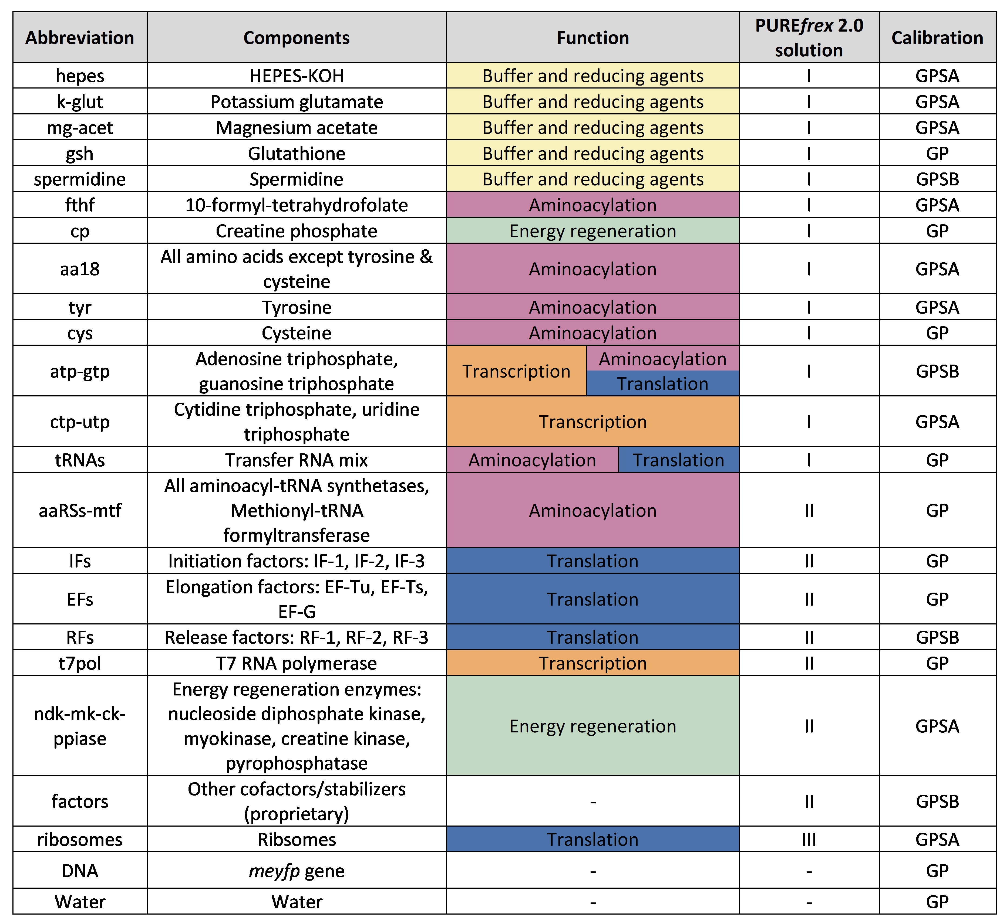
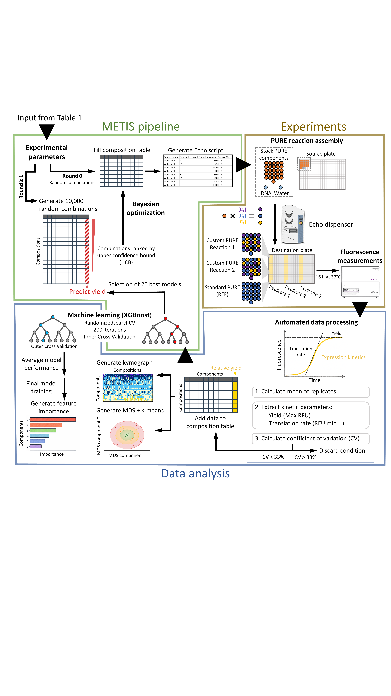

# PURE System Optimization Using Automation and Active Learning

[](https://www.python.org/)
[](LICENSE)

This repository contains all analysis scripts and active learning notebooks associated with the manuscript:

> **Optimization of PURE system composition using automation and active learning**  
> Yannick Bernard-Lapeyre, Céline Cleij, Andrei Sakai, Marie-José Huguet, Christophe Danelon  
> *Toulouse Biotechnology Institute (TBI), LAAS–CNRS, TU Delft, Radboud University*  
> bioRxiv doi: https://doi.org/10.64898/2026.03.23.713685

---

## Overview

The PURE (Protein synthesis Using Recombinant Elements) system is a fully reconstituted, cell-free transcription-translation platform. This project combines **acoustic liquid handling (Echo)** with the **METIS active learning framework** to systematically explore the ~10-billion-combination compositional space of PURE system.

By grouping 69 individual components into 21 functional sets and iterating over experimental rounds, we identified PURE compositions that yield **up to 3-fold improvements** in protein synthesis compared to the standard reference (REF), and applied this strategy to the expression of a 41-kb synthetic chromosome (MSG1.1).


### Experimental Parameterization of the PURE System



**Table 1 – Functional grouping of PURE components.**  
69 components are reduced to 21 variables based on biochemical roles. Each group is assigned an Echo liquid class to ensure accurate dispensing. This abstraction enables tractable exploration of the combinatorial space.

---

### Active Learning–Driven Optimization Workflow




**Figure 1 – Active learning workflow.**  
Closed-loop optimization combining Echo-based assembly, fluorescence readout, and XGBoost-driven Bayesian optimization to iteratively improve PURE compositions.


---

## Repository Structure

```
PURE_optimization_github/
│
├── active_learning/              # METIS-based optimization notebooks (Google Colab)
│   ├── PURE_Exploration_0_1nM_METIS_TBI.ipynb
│   ├── PURE_Exploration_2nM_TBI.ipynb
│   ├── PURE_Exploration_MSG1_1.ipynb
│   ├── PURE_Exploration_MSG1_1_C_change.ipynb
│   └── README.md
│
├── analysis/                     # Downstream data analysis
│   ├── machine_learning/         # XGBoost nested CV pipeline + feature importance
│   ├── dimensionality_reduction/ # MDS analysis scripts
│   ├── correlations/             # Spearman correlation analysis
│   ├── data_merging/             # Condition deduplication and merging
│   └── README.md
│
├── visualization/                # Figure generation scripts
│   ├── kymographs/               # Composition kymographs
│   ├── kinetics/                 # Fluorescence and absorbance kinetics
│   ├── yield_rate/               # Yield vs rate, Pareto front, bar charts
│   ├── heatmaps/                 # Mass spectrometry heatmaps
│   └── README.md
│
├── utils/                        # Shared utilities
│   ├── figure_utils.py           # Publication-quality figure scaling
│   └── README.md
│
└── README.md                     # This file
```

---

## Quick Start

### 1. Environment Setup

```bash
# Clone the repository
git clone https://github.com/your-username/PURE_optimization.git
cd PURE_optimization

# Create a virtual environment
python -m venv venv
source venv/bin/activate  # On Windows: venv\Scripts\activate

# Install dependencies
pip install -r requirements.txt
```

### 2. Active Learning (Google Colab)

The active learning notebooks are designed to run on **Google Colab**. Open any notebook in `active_learning/` directly from Google Drive. They will automatically:
- Install required packages (`xlsxwriter`)
- Download the METIS `utils.py` from GitHub
- Mount your Google Drive for data persistence

### 3. Offline Analysis

All scripts in `analysis/` and `visualization/` run locally. Update the file paths at the top of each script before running.

---

## Experimental Design

| DNA Concentration | Template | Batches | Rounds | Conditions |
|---|---|---|---|---|
| 0.1 nM | *meyfp* | Batch#1, Batch#2 | 0–5 | ~170 |
| 2 nM | *meyfp* | Batch#2 | 6–8 | ~156 |
| 0.1 nM | MSG1.1 (41 kb) | — | 1–8 | ~238 |
| 1 nM | MSG1.1 (41 kb) | — | 1–8 | ~237 |

---

## Key Results

- **3-fold yield improvement** over REF for *meyfp* expression
- **Distinct limiting regimes** at low (0.1 nM) vs. high (2 nM) DNA concentrations
- **Gene-specific optimization**: improving reporter yield does not uniformly enhance all proteins on the same plasmid
- **Composition-performance landscape** mapped via MDS + k-means clustering and kymograph representation
- **Nonlinear relationships between component concentrations and yield** identified with Spearman correlations

---

## Dependencies

```
pandas >= 2.2.1
numpy >= 1.26.4
matplotlib >= 3.10.6
seaborn >= 0.13.2
scikit-learn >= 1.4.2
scipy >= 1.16.0
xgboost >= 2.1.2
shap >= 0.46.0
openpyxl
xlsxwriter
joblib
```

Install all at once:
```bash
pip install -r requirements.txt
```

---

## Data

Raw fluorescence kinetics, PURE component concentration files, and Results CSVs are not all included in this repository due to size constraints. A selection of example files used for each script were uploaded and placed in associated example_data folders. Please contact the corresponding author for access: [danelon@insa-toulouse.fr](mailto:danelon@insa-toulouse.fr)

The expected input format for most analysis scripts is a CSV with:
- A `Condition` column (string label; must include a `REF` row)
- A `yield` column (float, relative to REF)
- One column per PURE component (float, concentration in nM or relative units)

---

## Active Learning Framework

This work builds on **METIS** ([Pandi et al., 2022, *Nat Commun*](https://doi.org/10.1038/s41467-022-31245-z)), which couples:
- **XGBoost regression** for yield prediction
- **Bayesian optimization** (Upper Confidence Bound) for candidate selection

The notebooks in `active_learning/` are modified versions of the METIS notebook adapted for PURE system components, Echo liquid handling. The original implementation is available at https://github.com/amirpandi/METIS.

---

## Citation

If you use this code, please cite:

```bibtex
@article{bernardlapeyre2026pure,
  title   = {Optimization of PURE system composition using automation and active learning},
  author  = {Bernard-Lapeyre, Yannick and Cleij, C{\'e}line and Sakai, Andrei 
             and Huguet, Marie-Jos{\'e} and Danelon, Christophe},
  journal = {[Journal]},
  year    = {2026},
}
```

---

## License

MIT License — see [LICENSE](LICENSE) for details.

---

## Contact

Christophe Danelon — [danelon@insa-toulouse.fr](mailto:danelon@insa-toulouse.fr)  
Toulouse Biotechnology Institute (TBI), INSA Toulouse, France
